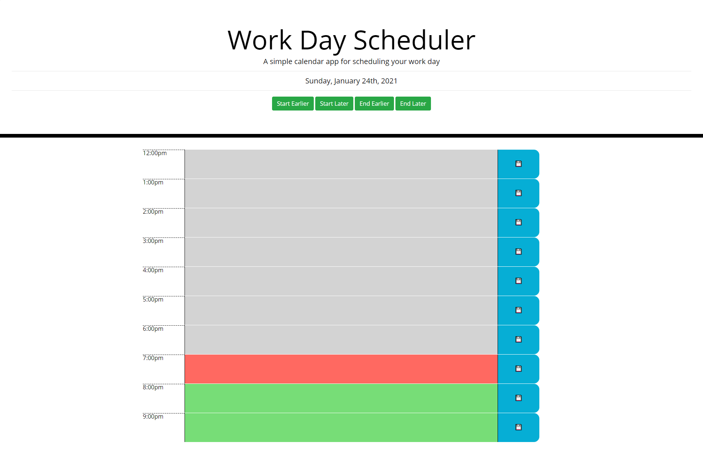

# Work-Day-Scheduler

## Description
This application display a set of blocks of time for a busy employee to plan their day.  When opened, the previously saved data in displayed in the appropriate blocks and the user can click on a textarea and enter new tasks.  If the user clicks the save button to the right of the textarea, the text is saved to localStorage.

The default day is 8am to 5pm, but the user can adjust the times just in case they arrive early or stay late or (hopefully) arrive late or leave early.

The present hour will be red. For example, any time from 8:00 to 8:59 will make the 8:00 block red.

If the time block is in the future, the display is green and block in the past are gray.

## Technologies
I used jQuery and JavaScript for processing and storing information.  Bootstrap and CSS was used for styling and HTML was used for the basic structure of the index page.

## What I learned:

* I learned a lot about Moment.  I found the documentation wished they continued to maintain it, but I understand that if it is too bulky.  I will need to find an alternative.

* I learned even more about listeners.  This time I learned when you clear and HTML element, the listeners disappear, too.

* I was able to create HTML dynamically, but I understand I should only do this when needed and nat always do it just because I think it's cool.

* I learned how to reverse engineer the CSS to match the mockup for the project.

## What I want to know more about:

* An alternative to Moment.

* JSON

* jQuery - I want to find time to read the documentation and explore the UI

## What I struggled with:

* I had a difficult time starting by creating the HTML from the CSS.  I was not sure what class went to children of which element, but I figured it out.

* I did struggle with Moment.js and I was able to figure out a solution to my problems with it, but it was not as elegant as I would like it to be.  The moment(time, 'h').fromNow() function kept returning results I was not expecting.

* I also spend some time on where and when to place listeners. I learned A LOT on this project.

* Again, I did not make as many commits I know I should.  Also, I should be making better messages for the commits I do send along.
 
## Functionality Demonstration

Image of the application:

Link to the Github deployment:
Click [here](https://charvey0.github.io/Work-Day-Scheduler/) to go to the GitHub Page.